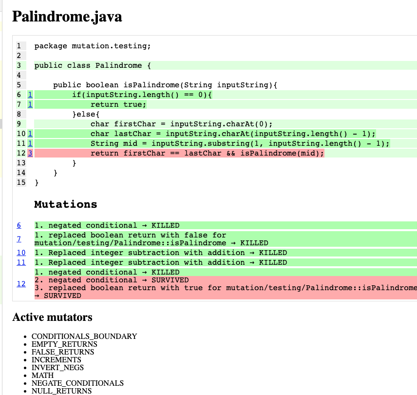

# Mutation Testing


## Quick Start

- Run the following command

```sh
./gradlew piTest
```
- The following output is shown

```
> Task :lib:pitest
-================================================================================
- Mutators
================================================================================
> org.pitest.mutationtest.engine.gregor.mutators.returns.BooleanTrueReturnValsMutator
>> Generated 1 Killed 0 (0%)
> KILLED 0 SURVIVED 1 TIMED_OUT 0 NON_VIABLE 0 
> MEMORY_ERROR 0 NOT_STARTED 0 STARTED 0 RUN_ERROR 0 
> NO_COVERAGE 0 
-----------------------------------------------------------
....

```
- The following report will be generated at 
[lib/build/reports/pitest/index.html](lib/build/reports/pitest/index.html)

It will look like below:


## References
- https://www.baeldung.com/java-mutation-testing-with-pitest
- https://gradle-pitest-plugin.solidsoft.info
- https://stryker-mutator.io/docs/mutation-testing-elements/sonarqube-integration/